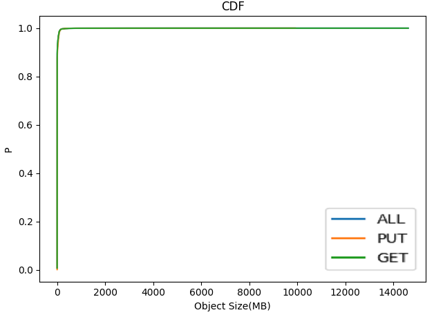

# Production traces

## Ali-trace (SOSP'21)

The trace contains 4 files.

`cdf-byte.csv` represents the CDF of total capacity occupied by different sizes of objects.

`cdf-traffic.csv` represents the CDF of total read traffic by different sizes of objects.

`cdf-count.csv `represents the CDF of the number of objects by different sizes of objects.

`cdf-frequency.csv` represents the CDF of the number of read requests by different sizes of objects.

## Trace from IBM Docker registry (FAST'18, FAST'21)

### Overview


### Format

6h/json file

```json
{
        "host": "ae280635", (mark)
        "http.request.duration": 0.256753663, 
        "http.request.method": "GET", (mark)
        "http.request.remoteaddr": "5fb803ae", 
        "http.request.uri": "v2/47cbd874/a83fa527/manifests/817c8a39", (mark)
        "http.request.useragent": "docker/1.12.0 go/go1.6.3 git-commit/535b3ac-unsupported kernel/4.4.0-45-generic os/linux arch/amd64 UpstreamClient(docker-py/1.10.6)", 
        "http.response.status": 200, 
        "http.response.written": 12285, (mark)
        "id": "bd9b7f5cac", 
        "timestamp": "2017-06-20T01:28:15.962Z"
}
```

### Analysis of zone Dallas (dal)
#### Full trace

|       Request Num        | 18161053  |
| :----------------------: | :-------: |
|     Put Request Num      |  738819   |
|    Put Sum Size (GB)     |  5098.31  |
|  Single Put Request Num  |  406290   |
| Single Put Sum Size (GB) |  5098.05  |
| Put Request Num (>= 1MB) |  110049   |
|     Get Request Num      | 17422234  |
|    Get Sum Size (GB)     | 100149.76 |
| Get Request Num (>= 1MB) |  2326630  |




#### Filter request size < 16KB and > 2GB

|        Request Num         | 3544534  |
| :------------------------: | :------: |
|      Put Request Num       |  154934  |
|      Get Request Num       | 3389600  |
| Avg. Put Request Size (MB) |  31.10   |
| Avg. Get Request Size (MB) |  28.53   |
| Requests Put Sum Size (GB) | 4705.52  |
|   Warm Put Sum Size (GB)   | 41729.41 |


#### First 3 days

|        Request Num         | 766229 |
| :------------------------: | :----: |
|      Put Request Num       | 40987  |
|      Get Request Num       | 725242 |
| Avg. Put Request Size (MB) |  7.67  |
| Avg. Get Request Size (MB) |  4.94  |
| Requests Put Sum Size (GB) | 307.00 |
|   Warm Put Sum Size (GB)   |        |


#### First 1 days

|        Request Num         | 256781 |
| :------------------------: | :----: |
|      Put Request Num       | 12091  |
|      Get Request Num       | 244690 |
| Avg. Put Request Size (MB) |  7.08  |
| Avg. Get Request Size (MB) |  4.38  |
| Requests Put Sum Size (GB) | 83.60  |
|   Warm Put Sum Size (GB)   |        |


#### First 12 hours

|        Request Num         | 120872 |
| :------------------------: | :----: |
|      Put Request Num       |  5774  |
|      Get Request Num       | 115098 |
| Avg. Put Request Size (MB) |  7.40  |
| Avg. Get Request Size (MB) |  3.84  |
| Requests Put Sum Size (GB) | 41.73  |
|   Warm Put Sum Size (GB)   |        |


#### First 6 hours

|        Request Num         | 50814 |
| :------------------------: | :---: |
|      Put Request Num       | 1893  |
|      Get Request Num       | 48921 |
| Avg. Put Request Size (MB) | 4.44  |
| Avg. Get Request Size (MB) | 3.04  |
| Requests Put Sum Size (GB) | 8.21  |
|   Warm Put Sum Size (GB)   |       |


